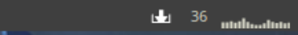

# Arch-linux Updates Widget

> Widget to [AwesomeWM](https://awesomewm.org/)

Display the amount of updates on menubar




## Installation

OS X & Linux:

```sh
git clone https://github.com/OdilonDamasceno/updates-arch-widget.git
```

```sh
cp -r updates-arch-widget/ ~/.config/awesome/
```

Or

```sh
cd ~/.config/awesome ; git clone https://github.com/OdilonDamasceno/updates-arch-widget.git
```

## Usage example

```sh

local updates_widget = require("updates-arch-widget.updates_arch")
    ...
    s.mywibox.widget = {
        ...
        {
            layout = wibox.layout.fixed.horizontal,
            updates_widget(),
        }
        ...
    }
```

## Meta

Odilon Damasceno – [@sirskey](https://twitter.com/sirskey) – odilondamasceno@protonmail.com

Distributed under the GPL-3.0 license. See ``LICENSE`` for more information.

[https://github.com/OdilonDamasceno/updates-arch-widget/blob/master/LICENSE](https://github.com/OdilonDamasceno/updates-arch-widget/blob/master/LICENSE)

## Contributing

1. Fork it (<https://github.com/OdilonDamasceno/updates-arch-widget>)
2. Create your feature branch (`git checkout -b feature/fooBar`)
3. Commit your changes (`git commit -am 'Add some fooBar'`)
4. Push to the branch (`git push origin feature/fooBar`)
5. Create a new Pull Request

<!-- Markdown link & img dfn's -->
[npm-image]: https://img.shields.io/npm/v/datadog-metrics.svg?style=flat-square
[npm-url]: https://npmjs.org/package/datadog-metrics
[npm-downloads]: https://img.shields.io/npm/dm/datadog-metrics.svg?style=flat-square
[travis-image]: https://img.shields.io/travis/dbader/node-datadog-metrics/master.svg?style=flat-square
[travis-url]: https://travis-ci.org/dbader/node-datadog-metrics
[wiki]: https://github.com/yourname/yourproject/wiki
